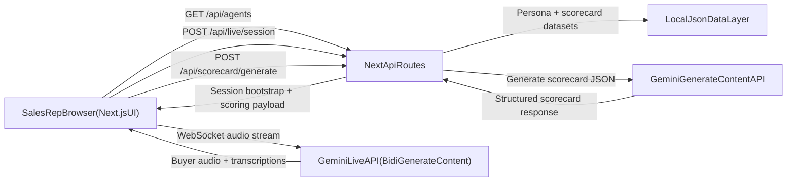

_This article was created specifically for the purpose of entering the Gemini Live Agent Challenge hackathon. If shared on social media, use the hashtag `#GeminiLiveAgentChallenge`._

## TL;DR

We built **PitchPerfect AI**, a real-time voice sales roleplay platform where:

- A sales rep picks a buyer persona.
- The rep has a live call with an AI buyer powered by **Gemini Live**.
- The app captures a transcript and generates a strict post-call coaching scorecard with **Gemini structured JSON outputs**.
- The system is deployable on **Google Cloud Run**.

This write-up covers architecture, implementation details, prompt engineering strategy, transcript/scoring pipeline, and lessons learned.

---

## Why We Built This

Enterprise sales teams are under pressure to improve call quality, but coaching still has a few major bottlenecks:

1. Human manager roleplay does not scale.
2. Reps do not get immediate, objective feedback.
3. Most AI call practice tools feel slow or robotic.

The goal for PitchPerfect AI was to make call practice feel natural and instant:

- **Real-time voice interaction** (not a delayed chat simulation).
- **Hard persona behavior** (buyer acts skeptical and busy).
- **Actionable feedback** right after the call.

---

## Table of contents

## Product Overview

PitchPerfect AI has three core product surfaces:

### 1) Persona Selection (`/roleplay`)

Reps browse and filter personas (industry, emotional state, call type, language), then select who they want to practice against.

### 2) Live Call Room (`/roleplay/live/[sessionId]`)

The browser microphone streams audio over WebSocket to Gemini Live. The AI buyer responds in voice and text signals that we parse for transcript turns.

### 3) Results + Coaching (`/roleplay/results/[callId]`)

At call end, transcript data is analyzed and graded:

- transcript review panel
- speaking analytics
- 5-section scorecard (Opener, Discovery, Social Proof, Takeaway, Closing)

---

## System Architecture

### Stack

- **Frontend:** Next.js (App Router), React, Tailwind, shadcn/ui
- **Realtime Voice:** WebSockets + Web Audio API + MediaRecorder API
- **LLM Realtime:** Gemini Live API
- **LLM Scoring:** Gemini generateContent API with strict JSON output
- **Hosting:** Google Cloud Run (deployment target)

---

## What Makes the Experience "Real-Time"

Traditional voice AI pipelines often chain:

`Speech-to-Text -> LLM -> Text-to-Speech`

That can feel laggy in interactive roleplay. We wanted lower latency and natural turn-taking.

### Live Audio Pipeline

In the browser live panel:

1. Capture microphone stream.
2. Convert float audio to PCM16.
3. Downsample to target rate.
4. Base64 encode and send over WebSocket frames.
5. Receive AI audio chunks and queue playback in an output audio context.

This approach gives us a more natural conversational rhythm and supports interruption-style dynamics in practice calls.

---

## Persona Engineering: Turning a Generic Model into a Tough Buyer

A key part of this project is **behavioral control**. If you do not constrain the model, it tends to become helpful and overly agreeable, which is bad for sales training.

So we construct strong `systemInstruction` payloads from:

- persona identity fields
- company context
- objection style
- discovery constraints
- dynamic runtime objections selected by the rep before the call

### Why Dynamic Objections Matter

Reps need to rehearse hard scenarios repeatedly:

- budget freeze
- incumbent loyalty
- "my team won't adopt another tool"

By injecting runtime objections directly into live session setup, the same persona can produce different challenge levels per session.

---

## Data Layer and Rubric Design

The app normalizes dataset files into strongly-typed domain models:

- agent summaries/profiles
- attributes and filters
- scorecard template/rubric

This is important for production reliability:

- predictable rendering
- consistent API contracts
- safer refactors

### Rubric

The scoring rubric is not "overall vibes." It is structured into concrete sections and criteria, with pass/fail evaluation and coaching text per criterion.

---

## Post-Call Scoring with Structured JSON

When a call ends:

1. Transcript turns are assembled server-side.
2. We build a strict scoring prompt with rubric context.
3. We call Gemini generateContent with JSON response configuration.
4. We parse and normalize output into the app scorecard schema.

We intentionally use strict shape constraints so the UI can reliably render every section and criterion.

---

## Deterministic Scoring Formula

The final score can be derived from criterion pass/fail results:

\[
\text{Score}_{\text{final}}
= \left(
\frac{\sum_{i=1}^{n} w_i\,p_i}{\sum_{i=1}^{n} w_i}
\right)\times 100
\]

Where:

- \(w_i\) is the weight of criterion \(i\)
- \(p_i \in \{0,1\}\) indicates whether the rep passed that criterion

Even when LLM-generated coaching language is qualitative, this score logic keeps overall grading grounded in deterministic criterion outcomes.

---

## Google AI + Google Cloud Integration

### Google AI Models

- **Gemini Live** for real-time voice buyer simulation.
- **Gemini generateContent** for post-call structured scorecard generation.

### Google Cloud

- Cloud Run deployment target for serving the Next.js app/API.
- Environment configuration for model keys and runtime.

This split keeps live interaction and scoring concerns decoupled while staying in the Google ecosystem.

---

## Implementation Notes That Helped Stability

A few practical details made a major difference:

1. **Robust WebSocket message handling**  
   Handle both string and Blob payloads before JSON parsing.

2. **Transcript turn merging**  
   Streaming transcripts can arrive in fragments. We merge intelligently to avoid word-by-word noise.

3. **Graceful API failure states**  
   Missing key/quota issues return clear response states so UI fails transparently, not silently.

4. **Prompt size control**  
   Overly large context blocks can hurt reliability. We clamp long prompt sections where needed.

---

## Challenges We Faced

### 1) Forcing realistic buyer behavior

Default model behavior is "nice assistant." Sales training needs resistance and skepticism. We had to codify negative constraints and persona consistency rules.

### 2) Realtime media plumbing in the browser

Handling PCM conversion, downsampling, queueing playback, and keeping connection state clean required careful resource lifecycle management.

### 3) Scoring reliability

"Grade this call" prompts were initially vague. We solved this with explicit rubric structure and strict output schema normalization.

### 4) Dev/deploy hygiene

Tracked build and dependency artifacts can break delivery pipelines. Cleaning git history and hardening `.gitignore` rules was essential.

---

## What We Learned

- Native real-time model interfaces change product UX quality dramatically.
- Prompt architecture is as important as model selection for behavior-heavy use cases.
- Strict JSON output patterns are critical for robust LLM-backed product surfaces.
- Small reliability details (state cleanup, response parsing, schema normalization) matter more than flashy demos.

---

## Impact Potential

PitchPerfect AI can enable:

- faster onboarding for new reps
- safer practice for difficult objections
- repeatable coaching quality across teams
- higher confidence before real prospect calls

Because the feedback loop is immediate, reps can iterate much faster than traditional weekly manager reviews.

---

## What's Next

1. **Live coaching nudges during calls**  
   Detect talk ratio drift, filler spikes, and missed discovery opportunities in-session.

2. **CRM-connected persona generation**  
   Generate practice personas from account/opportunity context.

3. **Team analytics**  
   Longitudinal dashboarding across rep cohorts and rubric trends.

4. **More advanced voice controls**  
   Persona-specific speaking pace, tone strictness, and interruption style tuning.

---

## Reproducibility Snapshot

Anyone reviewing the project can:

1. Install dependencies.
2. Configure Gemini API key.
3. Run lint/build.
4. Start dev server.
5. Complete one roleplay call and inspect results.

The repository `README` includes exact step-by-step validation instructions for judges.

---

## Hackathon Disclosure (Required)

This blog post was created for the purpose of entering the **Gemini Live Agent Challenge** hackathon.

If you share this post on social platforms, include the hashtag:

**`#GeminiLiveAgentChallenge`**
